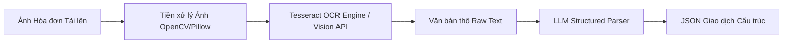

# AI Specifications & Model Documentation - Budgetly

> **Tài liệu Đặc tả Mạch Xử lý & Mô hình Trí tuệ Nhân tạo (AI/ML Subsystem)**  
> **Dự án:** Budgetly - Smart Personal Financial Management Platform  

---

## 1. Tổng quan Kiến trúc Mạch AI (AI Subsystem Overview)

Trong dự án Budgetly, thành phần Trí tuệ Nhân tạo (AI Engine) đóng vai trò là **tính năng cốt lõi (Core Highlight Requirement)** giúp tạo nên sự khác biệt so với các phần mềm quản lý tài chính truyền thống.

Mạch AI được xây dựng như một vi dịch vụ độc lập (`/ai_engine`), giao tiếp qua RESTful API với các nhiệm vụ chính:
1. **NLP Natural Text Transaction Parser:** Đọc hiểu văn bản tiếng Việt tự nhiên để trích xuất giao dịch cấu trúc.
2. **OCR Receipt Scanner & Structurer:** Trích xuất văn bản từ ảnh hóa đơn và chuẩn hóa thành đối tượng JSON.
3. **Predictive Spending Analytics & Anomaly Detector:** Phân tích chuỗi thời gian chi tiêu để dự báo và phát hiện điểm bất thường.

---

## 2. Tính năng 1: NLP Smart Transaction Categorization Engine

### 2.1. Mục tiêu & Luồng xử lý
Chuyển đổi chuỗi đầu vào không cấu trúc tiếng Việt (ví dụ: *"hôm qua tiêu 120k ăn đồ nướng với bạn"*) thành đối tượng dữ liệu tài chính chuẩn:
- **Số tiền (`amount`):** `120000` (Tự động quy đổi `k`, `ngàn`, `củ`, `tr`, `đ` sang con số nguyên).
- **Danh mục (`category`):** `Ăn uống`.
- **Ngày giao dịch (`transaction_date`):** Ngày hôm qua (Tự động tính dựa trên ngày hiện tại).
- **Loại giao dịch (`transaction_type`):** `EXPENSE`.
- **Điểm tin cậy (`confidence`):** `0.94` (Từ 0.0 đến 1.0).

### 2.2. Kỹ thuật triển khai & Prompt Engineering
Sử dụng mô hình ngôn ngữ lớn (LLM) kết hợp **Few-Shot Prompting** và **Structured Output (JSON Schema Verification)** để đảm bảo dữ liệu đầu ra luôn tuân thủ chính xác kiểu dữ liệu mong muốn.

#### Cấu trúc System Prompt Mẫu:
```text
Bạn là một trợ lý AI chuyên nghiệp về tài chính cá nhân tiếng Việt.
Nhiệm vụ của bạn là phân tích câu văn bản mô tả giao dịch của người dùng và trích xuất thành định dạng JSON chuẩn.

Hệ thống danh mục chuẩn bao gồm:
- Ăn uống (Food & Dining)
- Di chuyển (Transportation)
- Mua sắm (Shopping)
- Giải trí (Entertainment)
- Tiền nhà / Điện nước (Bills & Utilities)
- Sức khỏe (Healthcare)
- Thu nhập / Lương (Income)

Quy tắc xử lý đơn vị tiền tệ tiếng Việt:
- "k", "ngàn", "nghìn" -> nhân với 1,000. (VD: 50k -> 50000)
- "tr", "triệu" -> nhân với 1,000,000. (VD: 1.5tr -> 1500000)
- "củ" -> nhân với 1,000,000. (VD: 2 củ -> 2000000)

Yêu cầu đầu ra bắt buộc dạng JSON:
{
  "amount": number,
  "category": string,
  "transaction_type": "INCOME" | "EXPENSE",
  "transaction_date": "YYYY-MM-DD",
  "cleaned_description": string,
  "confidence": number
}
```

### 2.3. Thuật toán Tính điểm Tin cậy & Cơ chế Fallback (Confidence Thresholding)
- **Công thức điểm tin cậy (`confidence`):** Được tính dựa trên độ rõ ràng của cả 3 yếu tố: Số tiền được trích xuất (Amount Clarity), Danh mục khớp với Tập từ vựng chuẩn (Taxonomy Match), và Ý định Thu/Chi (Intent Confidence).
- **Ngưỡng hành động (Threshold Rules):**
  - **`Confidence >= 0.75` (High Confidence):** Tự động điền biểu mẫu và tự động lưu giao dịch vào DB. Hiển thị thông báo Toast kèm nút *"Hoàn tác"*.
  - **`Confidence < 0.75` (Low Confidence):** Mở cửa sổ Pop-up hiển thị dữ liệu gợi ý. Bắt buộc người dùng xem lại và nhấn nút *"Xác nhận Lưu"* thủ công.

---

## 3. Tính năng 2: OCR Receipt Scanning & Information Extraction

### 3.1. Kiến trúc Mạch xử lý Ảnh Hóa đơn
Mạch xử lý bao gồm 3 công đoạn nối tiếp:



### 3.2. Tiền xử lý Ảnh (Image Preprocessing)
- Chuyển ảnh về ảnh xám (Grayscale).
- Áp dụng kỹ thuật khử nhiễu và tăng độ tương phản (Adaptive Thresholding / Contrast Enhancement) để làm rõ chữ in trên giấy in nhiệt hóa đơn.

### 3.3. Trích xuất Cấu trúc từ Văn bản Thô (Post-OCR Parsing)
Chuỗi văn bản thô trích xuất từ OCR thường chứa lỗi chính tả hoặc khoảng trắng thừa. AI Engine chuyển chuỗi thô này qua mô hình ngôn ngữ để bóc tách các trường:
- `merchant_name`: Tên siêu thị / Cửa hàng.
- `total_amount`: Số tiền tổng thanh toán (`TONG CONG`, `TOTAL`, `THANH TOAN`).
- `transaction_date`: Ngày in hóa đơn.

---

## 4. Tính năng 3: Dự báo Chi tiêu & Phát hiện Bất thường (Predictive Analytics)

### 4.1. Mô hình Dự báo Chi tiêu Cuối tháng (Month-End Spending Forecast)
Dựa trên chuỗi thời gian chi tiêu $X = [x_1, x_2, ..., x_t]$ của các ngày đã qua trong tháng $m$:

$$\text{Tốc độ chi tiêu trung bình ngày (Daily Velocity)} = \bar{v} = \frac{\sum_{i=1}^{t} x_i}{t}$$

$$\text{Tổng chi tiêu dự báo cuối tháng (Projected Total)} = \sum_{i=1}^{t} x_i + \bar{v} \times (D - t)$$

*(Trong đó $D$ là tổng số ngày trong tháng $m$, $t$ là số ngày đã trôi qua).*

### 4.2. Thuật toán Phát hiện Bất thường (Z-Score Anomaly Detection)
Để phát hiện một khoản chi tiêu bất thường đột biến so với lịch sử thói quen của người dùng:

$$Z = \frac{x_i - \mu}{\sigma}$$

- $\mu$: Trung bình chi tiêu theo ngày trong 90 ngày quá khứ.
- $\sigma$: Độ lệch chuẩn chi tiêu.
- **Quy tắc Cảnh báo:** Nếu $Z > 2.5$ (khoản chi tiêu cao bất thường vượt 2.5 lần độ lệch chuẩn), hệ thống tự động ghi nhận một sự kiện `ANOMALY_DETECTED` và hiển thị lời khuyên cho người dùng.

---

## 5. Kế hoạch Đánh giá & Chỉ số Đo lường Mô hình (Evaluation & Metrics)

Để phục vụ việc báo cáo kết quả trong Đồ án môn học, mạch AI sẽ được đánh giá qua tập dữ liệu thử nghiệm (Test-set gồm 100 mẫu văn bản tiếng Việt và 30 mẫu ảnh hóa đơn thực tế):

| Tính năng AI | Chỉ số Đánh giá (Metric) | Mục tiêu Đồ án (Target Baseline) |
| :--- | :--- | :--- |
| **NLP Categorization** | Multi-class Accuracy & Macro F1-Score | **Accuracy >= 85%**, **F1-Score >= 0.82** |
| **NLP Amount Parsing** | Exact Match Accuracy (Độ chính xác số tiền) | **>= 92%** |
| **OCR Text Extraction** | Character Error Rate (CER) & Total Amount Accuracy | Total Amount Accuracy **>= 88%** |
| **Spending Forecast** | Mean Absolute Error (MAE) & Mean Absolute Percentage Error (MAPE) | MAPE **<= 12%** |
| **Latency SLA** | Average API Response Time | NLP **< 1.5s**, OCR **< 3.0s** |
