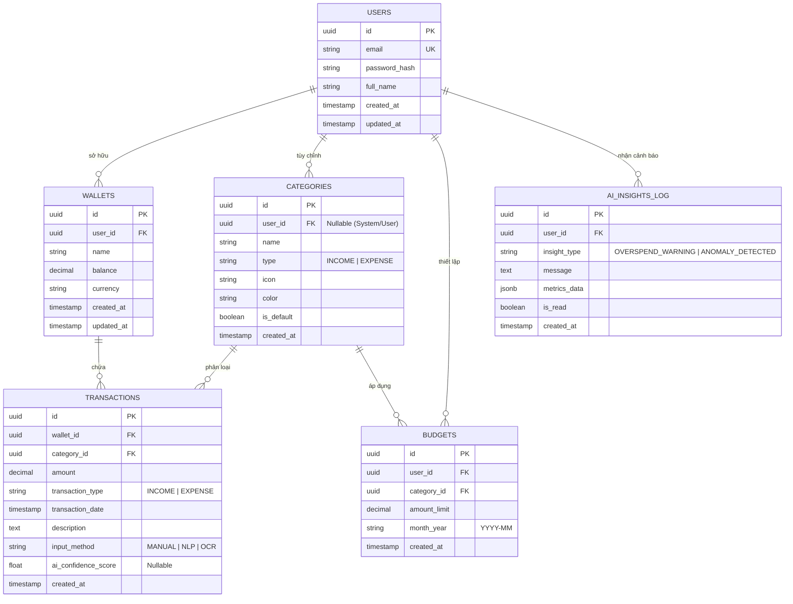

# Database Schema Specification - Budgetly

Tài liệu thiết kế chi tiết Cơ sở Dữ liệu Quan hệ (Relational Database Schema) cho hệ thống **Budgetly**.

---

## 1. Sơ đồ Thực thể Phụ thuộc (Entity Relationship Diagram - ERD)



---

## 2. Chi tiết Danh mục Bảng Dữ liệu (Detailed Table Specifications)

### 2.1. Bảng `users` (Quản lý Người dùng)
Lưu trữ thông tin tài khoản người dùng đăng nhập hệ thống.

| Tên Cột | Kiểu Dữ Liệu | Ràng Buộc | Mô Tả |
| :--- | :--- | :--- | :--- |
| `id` | `UUID` | `PRIMARY KEY, DEFAULT gen_random_uuid()` | Định danh duy nhất cho người dùng |
| `email` | `VARCHAR(255)` | `NOT NULL, UNIQUE` | Địa chỉ email đăng nhập |
| `password_hash` | `VARCHAR(255)` | `NOT NULL` | Chuỗi mã hóa mật khẩu (`bcrypt`) |
| `full_name` | `VARCHAR(100)` | `NULLABLE` | Họ và tên người dùng |
| `created_at` | `TIMESTAMP` | `NOT NULL, DEFAULT CURRENT_TIMESTAMP` | Thời gian tạo tài khoản |
| `updated_at` | `TIMESTAMP` | `NOT NULL, DEFAULT CURRENT_TIMESTAMP` | Thời gian cập nhật thông tin |

---

### 2.2. Bảng `wallets` (Ví Tài chính)
Lưu trữ các nguồn tiền / ví tài chính thuộc sở hữu của người dùng.

| Tên Cột | Kiểu Dữ Liệu | Ràng Buộc | Mô Tả |
| :--- | :--- | :--- | :--- |
| `id` | `UUID` | `PRIMARY KEY, DEFAULT gen_random_uuid()` | Định danh duy nhất cho ví |
| `user_id` | `UUID` | `NOT NULL, FOREIGN KEY -> users(id) ON DELETE CASCADE` | Người sở hữu ví |
| `name` | `VARCHAR(100)` | `NOT NULL` | Tên ví (ví dụ: Ví tiền mặt, ATM Vietcombank) |
| `balance` | `DECIMAL(15,2)` | `NOT NULL, DEFAULT 0.00` | Số dư tiền hiện tại trong ví |
| `currency` | `VARCHAR(10)` | `NOT NULL, DEFAULT 'VND'` | Đơn vị tiền tệ (VND, USD) |
| `created_at` | `TIMESTAMP` | `NOT NULL, DEFAULT CURRENT_TIMESTAMP` | Thời gian tạo ví |
| `updated_at` | `TIMESTAMP` | `NOT NULL, DEFAULT CURRENT_TIMESTAMP` | Thời gian cập nhật số dư |

---

### 2.3. Bảng `categories` (Danh mục Thu Chi)
Lưu trữ danh mục phân loại giao dịch (Cả danh mục mặc định của hệ thống và danh mục cá nhân hóa).

| Tên Cột | Kiểu Dữ Liệu | Ràng Buộc | Mô Tả |
| :--- | :--- | :--- | :--- |
| `id` | `UUID` | `PRIMARY KEY, DEFAULT gen_random_uuid()` | Định danh duy nhất cho danh mục |
| `user_id` | `UUID` | `NULLABLE, FOREIGN KEY -> users(id) ON DELETE CASCADE` | Null nếu là danh mục chung hệ thống; Khác Null nếu là danh mục tùy chỉnh của User |
| `name` | `VARCHAR(100)` | `NOT NULL` | Tên danh mục (Ăn uống, Lương, Mua sắm) |
| `type` | `VARCHAR(20)` | `NOT NULL, CHECK (type IN ('INCOME', 'EXPENSE'))` | Loại danh mục (Thu nhập hoặc Chi tiêu) |
| `icon` | `VARCHAR(50)` | `NULLABLE` | Tên biểu tượng hiển thị trên UI |
| `color` | `VARCHAR(20)` | `NULLABLE` | Mã màu HEX hiển thị trên biểu đồ |
| `is_default` | `BOOLEAN` | `NOT NULL, DEFAULT FALSE` | Đánh dấu danh mục hệ thống mặc định |
| `created_at` | `TIMESTAMP` | `NOT NULL, DEFAULT CURRENT_TIMESTAMP` | Thời gian tạo danh mục |

---

### 2.4. Bảng `transactions` (Giao dịch Thu Chi)
Lưu trữ thông tin chi tiết từng khoản giao dịch phát sinh.

| Tên Cột | Kiểu Dữ Liệu | Ràng Buộc | Mô Tả |
| :--- | :--- | :--- | :--- |
| `id` | `UUID` | `PRIMARY KEY, DEFAULT gen_random_uuid()` | Định danh duy nhất cho giao dịch |
| `wallet_id` | `UUID` | `NOT NULL, FOREIGN KEY -> wallets(id) ON DELETE CASCADE` | Ví phát sinh giao dịch |
| `category_id` | `UUID` | `NOT NULL, FOREIGN KEY -> categories(id) ON DELETE RESTRICT` | Danh mục của giao dịch |
| `amount` | `DECIMAL(15,2)` | `NOT NULL, CHECK (amount > 0)` | Số tiền giao dịch (luôn > 0) |
| `transaction_type`| `VARCHAR(20)` | `NOT NULL, CHECK (transaction_type IN ('INCOME', 'EXPENSE'))` | Loại giao dịch Thu/Chi |
| `transaction_date`| `TIMESTAMP` | `NOT NULL` | Ngày/giờ phát sinh giao dịch |
| `description` | `TEXT` | `NULLABLE` | Ghi chú/mô tả chi tiết |
| `input_method` | `VARCHAR(20)` | `NOT NULL, DEFAULT 'MANUAL'` | Phương thức nhập: `MANUAL`, `NLP`, `OCR` |
| `ai_confidence_score`| `FLOAT` | `NULLABLE` | Điểm độ tin cậy của AI (từ 0.0 đến 1.0) |
| `created_at` | `TIMESTAMP` | `NOT NULL, DEFAULT CURRENT_TIMESTAMP` | Thời gian ghi nhận vào DB |

---

### 2.5. Bảng `budgets` (Hạn mức Ngân sách)
Lưu trữ cài đặt giới hạn chi tiêu theo danh mục cho từng tháng.

| Tên Cột | Kiểu Dữ Liệu | Ràng Buộc | Mô Tả |
| :--- | :--- | :--- | :--- |
| `id` | `UUID` | `PRIMARY KEY, DEFAULT gen_random_uuid()` | Định danh duy nhất |
| `user_id` | `UUID` | `NOT NULL, FOREIGN KEY -> users(id) ON DELETE CASCADE` | Người cài đặt ngân sách |
| `category_id` | `UUID` | `NOT NULL, FOREIGN KEY -> categories(id) ON DELETE CASCADE` | Danh mục được giới hạn |
| `amount_limit` | `DECIMAL(15,2)` | `NOT NULL, CHECK (amount_limit > 0)` | Số tiền hạn mức tối đa |
| `month_year` | `VARCHAR(7)` | `NOT NULL` | Tháng năm áp dụng (Định dạng `YYYY-MM`) |
| `created_at` | `TIMESTAMP` | `NOT NULL, DEFAULT CURRENT_TIMESTAMP` | Thời gian cài đặt |

---

### 2.6. Bảng `ai_insights_log` (Lịch sử Cảnh báo AI)
Lưu trữ các thông báo dự báo chi tiêu và phát hiện bất thường do AI tính toán.

| Tên Cột | Kiểu Dữ Liệu | Ràng Buộc | Mô Tả |
| :--- | :--- | :--- | :--- |
| `id` | `UUID` | `PRIMARY KEY, DEFAULT gen_random_uuid()` | Định danh thông báo AI |
| `user_id` | `UUID` | `NOT NULL, FOREIGN KEY -> users(id) ON DELETE CASCADE` | Người nhận cảnh báo |
| `insight_type` | `VARCHAR(50)` | `NOT NULL` | Loại cảnh báo (`OVERSPEND_WARNING`, `ANOMALY`) |
| `message` | `TEXT` | `NOT NULL` | Nội dung câu cảnh báo hiển thị cho user |
| `metrics_data` | `JSONB` | `NULLABLE` | Dữ liệu chỉ số kỹ thuật kèm theo (forecasted_amount, z_score) |
| `is_read` | `BOOLEAN` | `NOT NULL, DEFAULT FALSE` | Trạng thái đã đọc hay chưa |
| `created_at` | `TIMESTAMP` | `NOT NULL, DEFAULT CURRENT_TIMESTAMP` | Thời gian tạo cảnh báo |

---

## 3. Chỉ Mộc & Tối Ưu Truy Vấn (Indexes Specification)

Để đảm bảo hiệu năng cao cho các truy vấn thống kê tài chính, cơ sở dữ liệu được đánh chỉ mục (Index) tại các cột chiến lược:

```sql
-- 1. Index tối ưu tìm kiếm giao dịch theo thời gian và người dùng/ví
CREATE INDEX idx_transactions_wallet_date ON transactions(wallet_id, transaction_date DESC);
CREATE INDEX idx_transactions_category_date ON transactions(category_id, transaction_date DESC);

-- 2. Index tối ưu lọc ngân sách theo tháng
CREATE INDEX idx_budgets_user_month ON budgets(user_id, month_year);

-- 3. Index danh mục người dùng
CREATE INDEX idx_categories_user ON categories(user_id);
```
