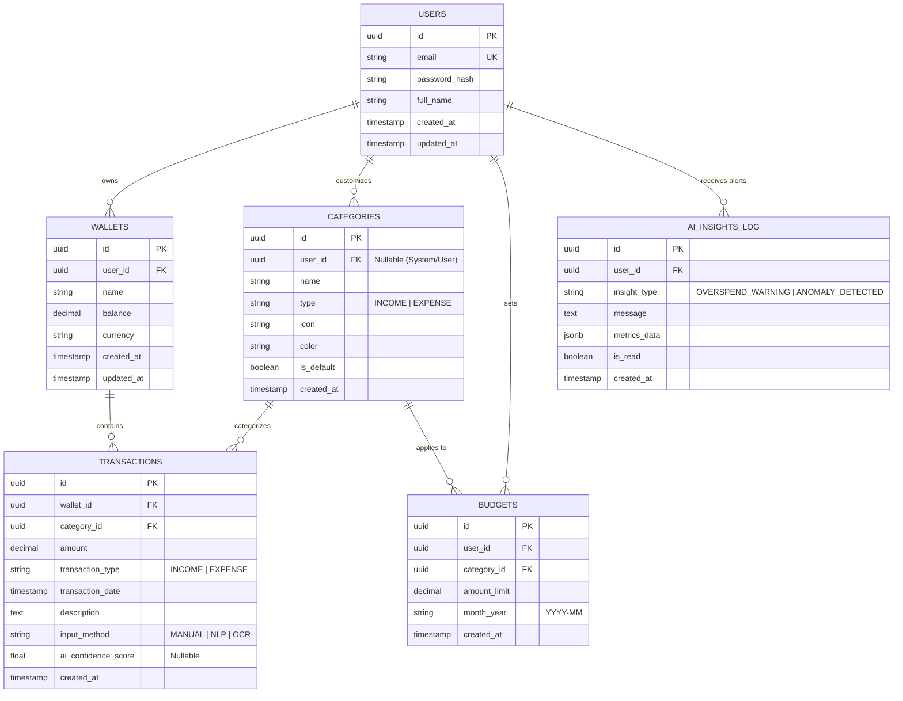

# Database Schema Specification - Budgetly

Detailed relational database schema design document for the **Budgetly** system.

---

## 1. Entity Relationship Diagram (ERD)


```mermaid
erDiagram
    USERS ||--o{ WALLETS : "owns"
    USERS ||--o{ CATEGORIES : "customizes"
    USERS ||--o{ BUDGETS : "sets"
    USERS ||--o{ AI_INSIGHTS_LOG : "receives alerts"

    WALLETS ||--o{ TRANSACTIONS : "contains"
    CATEGORIES ||--o{ TRANSACTIONS : "categorizes"
    CATEGORIES ||--o{ BUDGETS : "applies to"

    USERS {
        uuid id PK
        string email UK
        string password_hash
        string full_name
        timestamp created_at
        timestamp updated_at
    }

    WALLETS {
        uuid id PK
        uuid user_id FK
        string name
        decimal balance
        string currency
        timestamp created_at
        timestamp updated_at
    }

    CATEGORIES {
        uuid id PK
        uuid user_id FK "Nullable (System/User)"
        string name
        string type "INCOME | EXPENSE"
        string icon
        string color
        boolean is_default
        timestamp created_at
    }

    TRANSACTIONS {
        uuid id PK
        uuid wallet_id FK
        uuid category_id FK
        decimal amount
        string transaction_type "INCOME | EXPENSE"
        timestamp transaction_date
        text description
        string input_method "MANUAL | NLP | OCR"
        float ai_confidence_score "Nullable"
        timestamp created_at
    }

    BUDGETS {
        uuid id PK
        uuid user_id FK
        uuid category_id FK
        decimal amount_limit
        string month_year "YYYY-MM"
        timestamp created_at
    }

    AI_INSIGHTS_LOG {
        uuid id PK
        uuid user_id FK
        string insight_type "OVERSPEND_WARNING | ANOMALY_DETECTED"
        text message
        jsonb metrics_data
        boolean is_read
        timestamp created_at
    }
```

---

## 2. Detailed Table Specifications

### 2.1. `users` Table (User Management)
Stores account information for users who sign in to the system.

| Column Name | Data Type | Constraint | Description |
| :--- | :--- | :--- | :--- |
| `id` | `UUID` | `PRIMARY KEY, DEFAULT gen_random_uuid()` | Unique identifier for the user |
| `email` | `VARCHAR(255)` | `NOT NULL, UNIQUE` | Login email address |
| `password_hash` | `VARCHAR(255)` | `NOT NULL` | Hashed password string (`bcrypt`) |
| `full_name` | `VARCHAR(100)` | `NULLABLE` | User's full name |
| `created_at` | `TIMESTAMP` | `NOT NULL, DEFAULT CURRENT_TIMESTAMP` | Account creation timestamp |
| `updated_at` | `TIMESTAMP` | `NOT NULL, DEFAULT CURRENT_TIMESTAMP` | Profile update timestamp |

---

### 2.2. `wallets` Table (Financial Wallets)
Stores the funding sources / financial wallets owned by users.

| Column Name | Data Type | Constraint | Description |
| :--- | :--- | :--- | :--- |
| `id` | `UUID` | `PRIMARY KEY, DEFAULT gen_random_uuid()` | Unique identifier for the wallet |
| `user_id` | `UUID` | `NOT NULL, FOREIGN KEY -> users(id) ON DELETE CASCADE` | Owner of the wallet |
| `name` | `VARCHAR(100)` | `NOT NULL` | Wallet name (e.g., Cash Wallet, Vietcombank ATM) |
| `balance` | `DECIMAL(15,2)` | `NOT NULL, DEFAULT 0.00` | Current balance in the wallet |
| `currency` | `VARCHAR(10)` | `NOT NULL, DEFAULT 'VND'` | Currency unit (VND, USD) |
| `created_at` | `TIMESTAMP` | `NOT NULL, DEFAULT CURRENT_TIMESTAMP` | Wallet creation timestamp |
| `updated_at` | `TIMESTAMP` | `NOT NULL, DEFAULT CURRENT_TIMESTAMP` | Balance update timestamp |

---

### 2.3. `categories` Table (Income/Expense Categories)
Stores transaction classification categories (both system default categories and personalized categories).

| Column Name | Data Type | Constraint | Description |
| :--- | :--- | :--- | :--- |
| `id` | `UUID` | `PRIMARY KEY, DEFAULT gen_random_uuid()` | Unique identifier for the category |
| `user_id` | `UUID` | `NULLABLE, FOREIGN KEY -> users(id) ON DELETE CASCADE` | Null if it is a system-wide category; non-null if it is a user-defined custom category |
| `name` | `VARCHAR(100)` | `NOT NULL` | Category name (Food & Dining, Salary, Shopping) |
| `type` | `VARCHAR(20)` | `NOT NULL, CHECK (type IN ('INCOME', 'EXPENSE'))` | Category type (Income or Expense) |
| `icon` | `VARCHAR(50)` | `NULLABLE` | Icon name displayed in the UI |
| `color` | `VARCHAR(20)` | `NULLABLE` | HEX color code displayed in charts |
| `is_default` | `BOOLEAN` | `NOT NULL, DEFAULT FALSE` | Marks a system default category |
| `created_at` | `TIMESTAMP` | `NOT NULL, DEFAULT CURRENT_TIMESTAMP` | Category creation timestamp |

---

### 2.4. `transactions` Table (Income/Expense Transactions)
Stores detailed information for each transaction that occurs.

| Column Name | Data Type | Constraint | Description |
| :--- | :--- | :--- | :--- |
| `id` | `UUID` | `PRIMARY KEY, DEFAULT gen_random_uuid()` | Unique identifier for the transaction |
| `wallet_id` | `UUID` | `NOT NULL, FOREIGN KEY -> wallets(id) ON DELETE CASCADE` | Wallet in which the transaction occurred |
| `category_id` | `UUID` | `NOT NULL, FOREIGN KEY -> categories(id) ON DELETE RESTRICT` | Category of the transaction |
| `amount` | `DECIMAL(15,2)` | `NOT NULL, CHECK (amount > 0)` | Transaction amount (always > 0) |
| `transaction_type`| `VARCHAR(20)` | `NOT NULL, CHECK (transaction_type IN ('INCOME', 'EXPENSE'))` | Transaction type: Income/Expense |
| `transaction_date`| `TIMESTAMP` | `NOT NULL` | Date/time the transaction occurred |
| `description` | `TEXT` | `NULLABLE` | Notes/detailed description |
| `input_method` | `VARCHAR(20)` | `NOT NULL, DEFAULT 'MANUAL'` | Input method: `MANUAL`, `NLP`, `OCR` |
| `ai_confidence_score`| `FLOAT` | `NULLABLE` | AI confidence score (from 0.0 to 1.0) |
| `created_at` | `TIMESTAMP` | `NOT NULL, DEFAULT CURRENT_TIMESTAMP` | Time recorded in the DB |

---

### 2.5. `budgets` Table (Budget Limits)
Stores per-category spending limits for each month.

| Column Name | Data Type | Constraint | Description |
| :--- | :--- | :--- | :--- |
| `id` | `UUID` | `PRIMARY KEY, DEFAULT gen_random_uuid()` | Unique identifier |
| `user_id` | `UUID` | `NOT NULL, FOREIGN KEY -> users(id) ON DELETE CASCADE` | User who sets the budget |
| `category_id` | `UUID` | `NOT NULL, FOREIGN KEY -> categories(id) ON DELETE CASCADE` | Category being limited |
| `amount_limit` | `DECIMAL(15,2)` | `NOT NULL, CHECK (amount_limit > 0)` | Maximum limit amount |
| `month_year` | `VARCHAR(7)` | `NOT NULL` | Applicable month (format `YYYY-MM`) |
| `created_at` | `TIMESTAMP` | `NOT NULL, DEFAULT CURRENT_TIMESTAMP` | Time the budget was set |

---

### 2.6. `ai_insights_log` Table (AI Alert History)
Stores spending forecast notifications and anomaly detections computed by the AI.

| Column Name | Data Type | Constraint | Description |
| :--- | :--- | :--- | :--- |
| `id` | `UUID` | `PRIMARY KEY, DEFAULT gen_random_uuid()` | AI notification identifier |
| `user_id` | `UUID` | `NOT NULL, FOREIGN KEY -> users(id) ON DELETE CASCADE` | Alert recipient |
| `insight_type` | `VARCHAR(50)` | `NOT NULL` | Alert type (`OVERSPEND_WARNING`, `ANOMALY`) |
| `message` | `TEXT` | `NOT NULL` | Alert message content displayed to the user |
| `metrics_data` | `JSONB` | `NULLABLE` | Accompanying technical metric data (forecasted_amount, z_score) |
| `is_read` | `BOOLEAN` | `NOT NULL, DEFAULT FALSE` | Read status |
| `created_at` | `TIMESTAMP` | `NOT NULL, DEFAULT CURRENT_TIMESTAMP` | Time the alert was created |

---

## 3. Indexes & Query Optimization (Indexes Specification)

To ensure high performance for financial statistics queries, the database is indexed on strategic columns:

```sql
-- 1. Index optimizing transaction lookups by time and user/wallet
CREATE INDEX idx_transactions_wallet_date ON transactions(wallet_id, transaction_date DESC);
CREATE INDEX idx_transactions_category_date ON transactions(category_id, transaction_date DESC);

-- 2. Index optimizing budget filtering by month
CREATE INDEX idx_budgets_user_month ON budgets(user_id, month_year);

-- 3. User category index
CREATE INDEX idx_categories_user ON categories(user_id);
```
