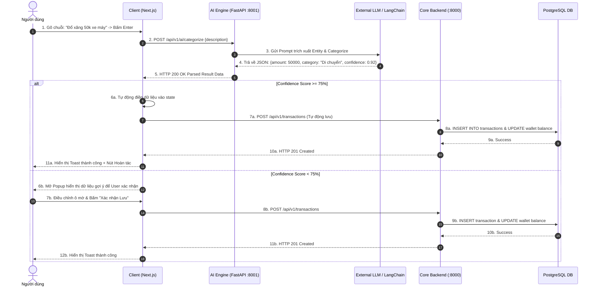
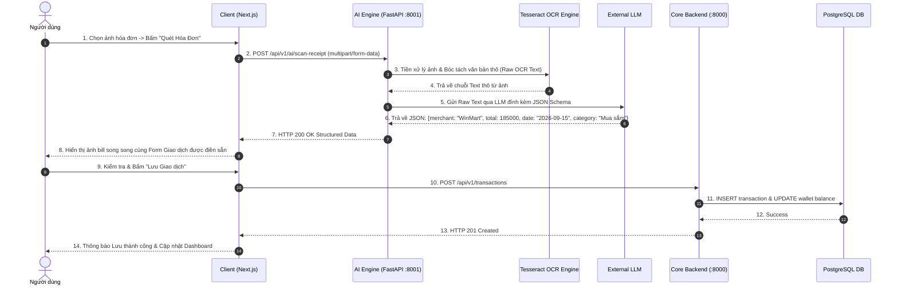
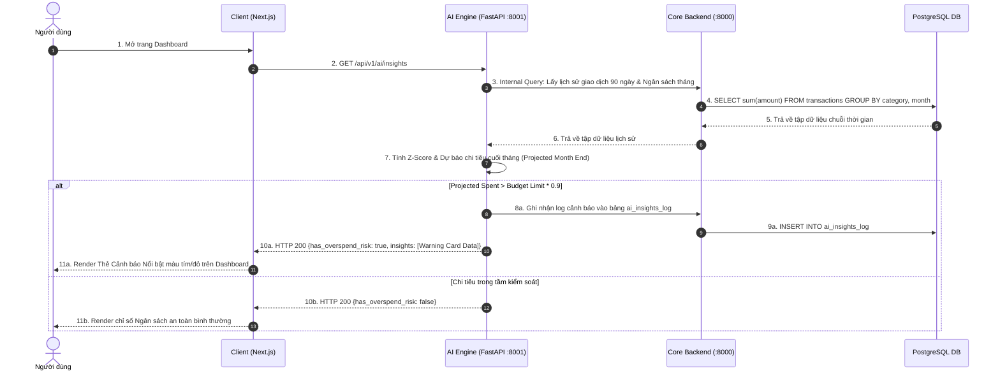

# Sequence Diagrams Specification - Budgetly

Tài liệu thiết kế các Sơ đồ Tuần tự (Sequence Diagrams) mô tả chi tiết tương tác theo thời gian giữa các thành phần trong hệ thống **Budgetly** cho các kịch bản cốt lõi.

---

## 1. Kịch bản 1: Đăng nhập & Xác thực JWT (Authentication Flow)

Sơ đồ mô tả quy trình người dùng gửi thông tin đăng nhập, Core Backend kiểm tra mật khẩu đã băm và phát hành JWT Token.

```mermaid
sequenceDiagram
    autonumber
    actor User as Người dùng
    participant Client as Client (Next.js)
    participant Server as Core Server (FastAPI)
    participant DB as PostgreSQL DB

    User->>Client: 1. Nhập Email & Mật khẩu -> Bấm "Đăng nhập"
    Client->>Server: 2. POST /api/v1/auth/login {email, password}
    Server->>DB: 3. SELECT * FROM users WHERE email = :email
    DB-->>Server: 4. Trả về thông tin user & password_hash
    
    alt Sai Mật khẩu hoặc Không tìm thấy User
        Server-->>Client: 5a. HTTP 401 Unauthorized {message: "Sai email hoặc mật khẩu"}
        Client-->>User: 6a. Hiển thị thông báo lỗi trên UI
    else Đăng nhập Thành công
        Server->>Server: 5b. Verify bcrypt hash & Tạo JWT Token (expiry 24h)
        Server-->>Client: 6b. HTTP 200 OK {access_token, user_info}
        Client->>Client: 7. Lưu access_token vào localStorage / Cookies
        Client-->>User: 8. Chuyển hướng đến màn hình Dashboard
    end
```

---

## 2. Kịch bản 2: Nhập Giao dịch Tự động qua NLP Smart Input (NLP Flow)

Sơ đồ mô tả quy trình người dùng gõ văn bản tự nhiên, AI Engine phân tích ngữ nghĩa và trích xuất dữ liệu giao dịch cấu trúc.

---

## 3. Kịch bản 3: Quét Hóa đơn qua OCR (OCR Receipt Scan Flow)

Sơ đồ mô tả luồng tải ảnh bill, OCR trích xuất chuỗi thô và LLM chuyển hóa dữ liệu thành giao dịch tài chính.

---

## 4. Kịch bản 4: Phân tích Dự báo Chi tiêu AI (AI Forecasting & Insight Flow)

Sơ đồ mô tả quy trình AI Engine truy vấn dữ liệu chi tiêu lịch sử để tính toán tốc độ tiêu tiền và đưa ra cảnh báo sớm.

