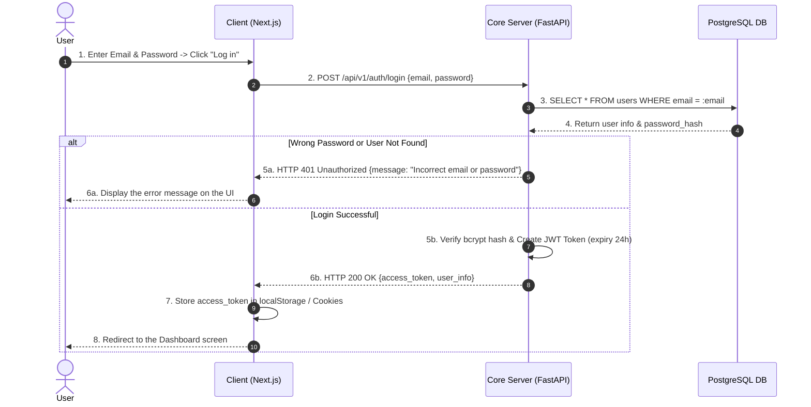
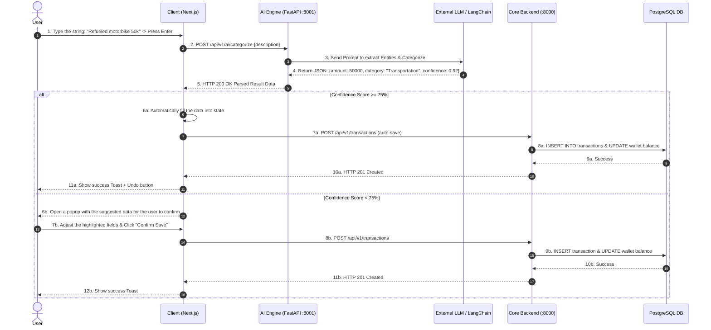
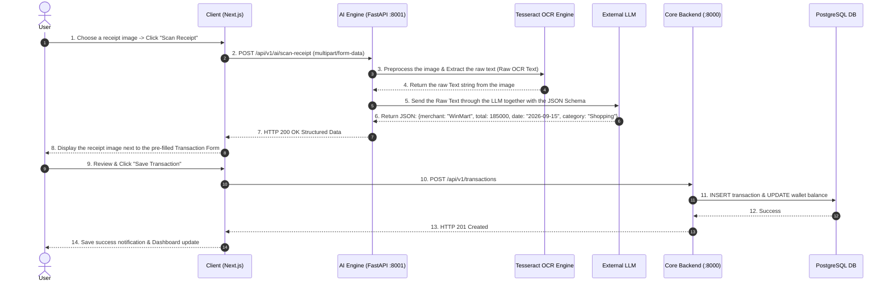
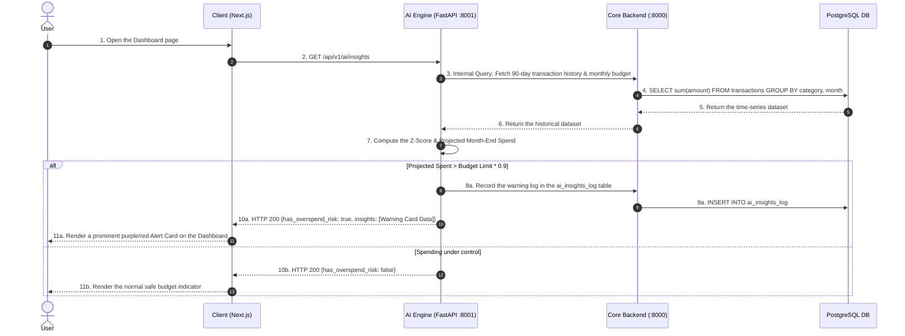

# Sequence Diagrams Specification - Budgetly

This document specifies the Sequence Diagrams that describe, in detail, the chronological interactions between components of the **Budgetly** system for the core scenarios.

---

## 1. Scenario 1: Login & JWT Authentication (Authentication Flow)

The diagram describes the process in which the user submits login credentials, the Core Backend verifies the hashed password, and a JWT Token is issued.

```mermaid
sequenceDiagram
    autonumber
    actor User as User
    participant Client as Client (Next.js)
    participant Server as Core Server (FastAPI)
    participant DB as PostgreSQL DB

    User->>Client: 1. Enter Email & Password -> Click "Log in"
    Client->>Server: 2. POST /api/v1/auth/login {email, password}
    Server->>DB: 3. SELECT * FROM users WHERE email = :email
    DB-->>Server: 4. Return user info & password_hash
    
    alt Wrong Password or User Not Found
        Server-->>Client: 5a. HTTP 401 Unauthorized {message: "Incorrect email or password"}
        Client-->>User: 6a. Display the error message on the UI
    else Login Successful
        Server->>Server: 5b. Verify bcrypt hash & Create JWT Token (expiry 24h)
        Server-->>Client: 6b. HTTP 200 OK {access_token, user_info}
        Client->>Client: 7. Store access_token in localStorage / Cookies
        Client-->>User: 8. Redirect to the Dashboard screen
    end
```

---

## 2. Scenario 2: Automatic Transaction Entry via NLP Smart Input (NLP Flow)

The diagram describes the process in which the user types a natural-language sentence, the AI Engine performs semantic analysis, and the structured transaction data is extracted.

```mermaid
sequenceDiagram
    autonumber
    actor User as User
    participant Client as Client (Next.js)
    participant AI as AI Engine (FastAPI :8001)
    participant LLM as External LLM / LangChain
    participant Core as Core Backend (:8000)
    participant DB as PostgreSQL DB

    User->>Client: 1. Type the string: "Refueled motorbike 50k" -> Press Enter
    Client->>AI: 2. POST /api/v1/ai/categorize {description}
    AI->>LLM: 3. Send Prompt to extract Entities & Categorize
    LLM-->>AI: 4. Return JSON: {amount: 50000, category: "Transportation", confidence: 0.92}
    
    AI-->>Client: 5. HTTP 200 OK Parsed Result Data
    
    alt Confidence Score >= 75%
        Client->>Client: 6a. Automatically fill the data into state
        Client->>Core: 7a. POST /api/v1/transactions (auto-save)
        Core->>DB: 8a. INSERT INTO transactions & UPDATE wallet balance
        DB-->>Core: 9a. Success
        Core-->>Client: 10a. HTTP 201 Created
        Client-->>User: 11a. Show success Toast + Undo button
    else Confidence Score < 75%
        Client-->>User: 6b. Open a popup with the suggested data for the user to confirm
        User->>Client: 7b. Adjust the highlighted fields & Click "Confirm Save"
        Client->>Core: 8b. POST /api/v1/transactions
        Core->>DB: 9b. INSERT transaction & UPDATE wallet balance
        DB-->>Core: 10b. Success
        Core-->>Client: 11b. HTTP 201 Created
        Client-->>User: 12b. Show success Toast
    end
```

---

## 3. Scenario 3: Receipt Scanning via OCR (OCR Receipt Scan Flow)

The diagram describes the flow of uploading a receipt image, OCR extracting the raw string, and the LLM converting the data into a financial transaction.

```mermaid
sequenceDiagram
    autonumber
    actor User as User
    participant Client as Client (Next.js)
    participant AI as AI Engine (FastAPI :8001)
    participant OCR as Tesseract OCR Engine
    participant LLM as External LLM
    participant Core as Core Backend (:8000)
    participant DB as PostgreSQL DB

    User->>Client: 1. Choose a receipt image -> Click "Scan Receipt"
    Client->>AI: 2. POST /api/v1/ai/scan-receipt (multipart/form-data)
    AI->>OCR: 3. Preprocess the image & Extract the raw text (Raw OCR Text)
    OCR-->>AI: 4. Return the raw Text string from the image
    
    AI->>LLM: 5. Send the Raw Text through the LLM together with the JSON Schema
    LLM-->>AI: 6. Return JSON: {merchant: "WinMart", total: 185000, date: "2026-09-15", category: "Shopping"}
    
    AI-->>Client: 7. HTTP 200 OK Structured Data
    Client-->>User: 8. Display the receipt image next to the pre-filled Transaction Form
    
    User->>Client: 9. Review & Click "Save Transaction"
    Client->>Core: 10. POST /api/v1/transactions
    Core->>DB: 11. INSERT transaction & UPDATE wallet balance
    DB-->>Core: 12. Success
    Core-->>Client: 13. HTTP 201 Created
    Client-->>User: 14. Save success notification & Dashboard update
```

---

## 4. Scenario 4: AI Spending Forecast & Insights (AI Forecasting & Insight Flow)

The diagram describes the process in which the AI Engine queries historical spending data to compute the spending velocity and issue early warnings.

```mermaid
sequenceDiagram
    autonumber
    actor User as User
    participant Client as Client (Next.js)
    participant AI as AI Engine (FastAPI :8001)
    participant Core as Core Backend (:8000)
    participant DB as PostgreSQL DB

    User->>Client: 1. Open the Dashboard page
    Client->>AI: 2. GET /api/v1/ai/insights
    AI->>Core: 3. Internal Query: Fetch 90-day transaction history & monthly budget
    Core->>DB: 4. SELECT sum(amount) FROM transactions GROUP BY category, month
    DB-->>Core: 5. Return the time-series dataset
    Core-->>AI: 6. Return the historical dataset
    
    AI->>AI: 7. Compute the Z-Score & Projected Month-End Spend
    
    alt Projected Spent > Budget Limit * 0.9
        AI->>Core: 8a. Record the warning log in the ai_insights_log table
        Core->>DB: 9a. INSERT INTO ai_insights_log
        AI-->>Client: 10a. HTTP 200 {has_overspend_risk: true, insights: [Warning Card Data]}
        Client-->>User: 11a. Render a prominent purple/red Alert Card on the Dashboard
    else Spending under control
        AI-->>Client: 10b. HTTP 200 {has_overspend_risk: false}
        Client-->>User: 11b. Render the normal safe budget indicator
    end
```
