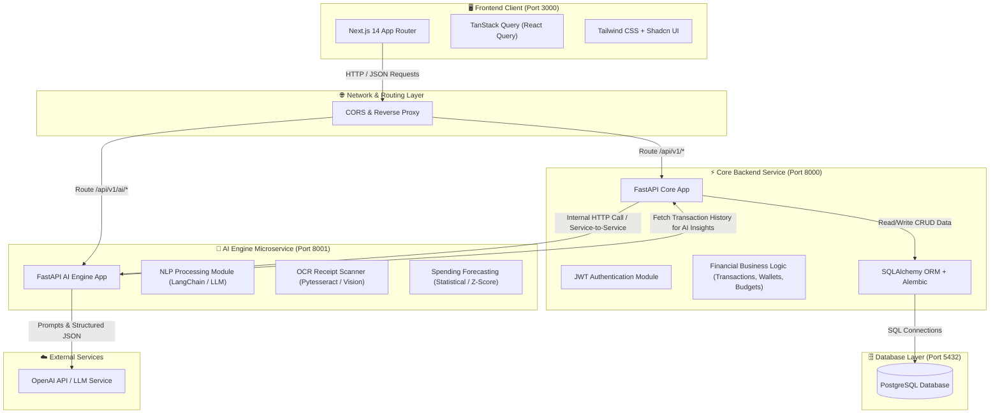
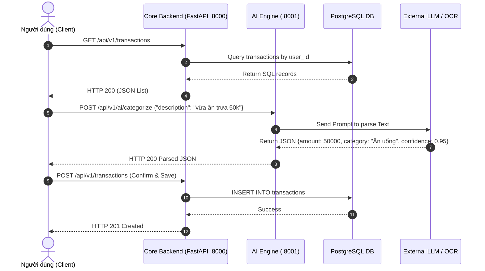

# System Architecture Specification - Budgetly

Tài liệu thiết kế Kiến trúc Hệ thống cho ứng dụng **Budgetly (Smart Personal Financial Management Platform)**.

---

## 1. Tổng quan Kiến trúc Hệ thống (Architectural Overview)

Budgetly được thiết kế theo mô hình **Microservices-oriented Monorepo Architecture**, chia tách rõ ràng giữa phân hệ giao diện (Client Frontend), phân hệ nghiệp vụ cốt lõi (Core Backend API), vi dịch vụ trí tuệ nhân tạo (AI Engine Microservice) và cơ sở dữ liệu quan hệ (PostgreSQL Database).

### Các nguyên tắc thiết kế chủ đạo:
1. **Decoupled AI Engine:** Tách vi dịch vụ AI độc lập khỏi Core Backend giúp độc lập khả năng mở rộng (scale), ngăn chặn việc các tác vụ tính toán nặng AI (OCR, LLM inference) làm nghẽn các yêu cầu CRUD tài chính thông thường.
2. **Stateless Core Backend:** Core Backend được thiết kế phi trạng thái (Stateless), xác thực người dùng thông qua chuẩn JWT (JSON Web Token), dễ dàng mở rộng theo chiều ngang.
3. **Single Source of Truth:** Cơ sở dữ liệu PostgreSQL đóng vai trò lưu trữ tập trung duy nhất cho toàn bộ hệ thống.

---

## 2. Sơ đồ Kiến trúc Tổng quan (System Architecture Diagram)

---

## 3. Luồng Truyền Dữ liệu Tổng thể (Data Flow Diagram)

---

## 4. Chi tiết các Phân hệ & Vai trò (Component Breakdown)

### 4.1. Frontend Client (`/client`)
- **Công nghệ:** Next.js 14 (TypeScript), Tailwind CSS, Lucide Icons, TanStack Query (React Query).
- **Trách nhiệm:**
  - Hiển thị giao diện người dùng responsive, tối ưu trải nghiệm trên di động và máy tính.
  - Quản lý trạng thái giao diện (UI State) và bộ nhớ đệm API (API Caching).
  - Gửi request mã hóa JWT Token qua HTTP Headers (`Authorization: Bearer <token>`).
  - Render các biểu đồ tương tác (Pie Chart, Bar Chart) để trực quan hóa dữ liệu tài chính.

### 4.2. Core Backend Service (`/server`)
- **Công nghệ:** Python 3.11+, FastAPI, SQLAlchemy ORM, Pydantic v2, Alembic, Passlib (`bcrypt`).
- **Trách nhiệm:**
  - Xử lý các quy trình nghiệp vụ tài chính (CRUD Ví, Danh mục, Giao dịch, Ngân sách).
  - Quản lý xác thực & phân quyền người dùng (User Authentication & Authorization).
  - Đảm bảo tính toàn vẹn dữ liệu quan hệ (Data Integrity & Foreign Key constraints).
  - Tự động cập nhật số dư Ví khi phát sinh giao dịch mới hoặc điều chỉnh giao dịch cũ.

### 4.3. AI Engine Microservice (`/ai_engine`)
- **Công nghệ:** Python 3.11+, FastAPI, LangChain, Pytesseract OCR / Pillow, scikit-learn, OpenAI API Client.
- **Trách nhiệm:**
  - **NLP Categorization Service:** Đọc hiểu văn bản tiếng Việt tự nhiên, xác định ý định (Intent), số tiền (Amount), ngày (Date), danh mục (Category) và điểm tin cậy (Confidence Score).
  - **OCR Receipt Parsing Service:** Tiền xử lý ảnh hóa đơn, trích xuất chuỗi ký tự qua OCR engine, đưa qua mô hình ngôn ngữ để chuyển hóa thành JSON cấu trúc chuẩn.
  - **Analytics & Forecasting Service:** Chạy thuật toán thống kê (Z-score anomaly detection) trên chuỗi dữ liệu giao dịch 3 tháng gần nhất để dự báo chi tiêu và đưa ra cảnh báo sớm.

### 4.4. Database Layer (`/server/models`)
- **Công nghệ:** PostgreSQL 15+.
- **Trách nhiệm:**
  - Lưu trữ bền vững dữ liệu tài chính, tài khoản và lịch sử cảnh báo AI.
  - Cung cấp tính năng Transactional ACID cho các thao tác liên quan đến tiền tệ.

---

## 5. Kiến trúc Bảo mật (Security Architecture)

1. **Xác thực JWT Token (JSON Web Token):**
   - Sử dụng thuật toán `HS256` với khóa bí mật (`SECRET_KEY`).
   - Token có thời gian hết hạn (Expiration: 24h).
2. **Mã hóa Mật khẩu (Password Hashing):**
   - Mật khẩu người dùng được băm bằng thuật toán `bcrypt` trước khi lưu vào DB. Không lưu trữ mật khẩu ở dạng plain text dưới bất kỳ hình thức nào.
3. **Bảo vệ Cô lập Dữ liệu (Tenant Isolation):**
   - Mọi câu truy vấn SQL liên quan đến tài chính đều bắt buộc kèm điều kiện `WHERE user_id = :current_user_id` để ngăn chặn truy cập trái phép chéo giữa các người dùng.
4. **CORS Policy & Environment Security:**
   - Cấu hình Middleware CORS kiểm soát chính xác danh sách Domain được phép gọi API.
   - Các API Key nhạy cảm (như OpenAI Key, DB Connection String) được quản lý qua biến môi trường `.env` và bảo mật bằng Docker Secret / `.gitignore`.
