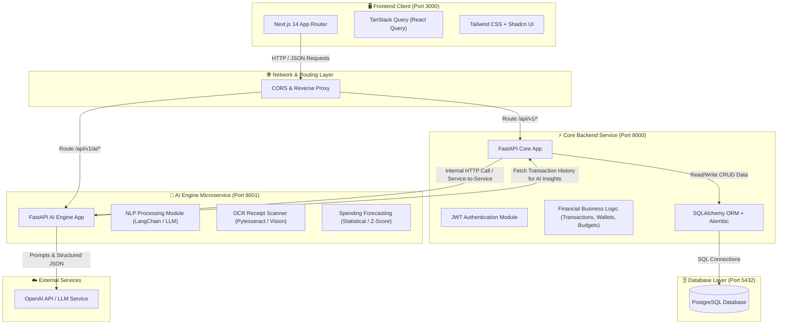
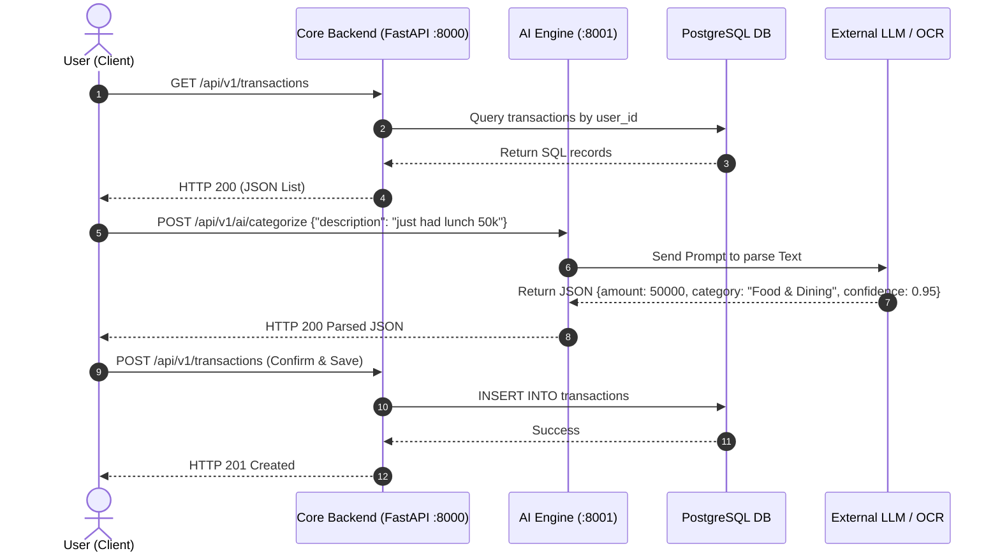

# System Architecture Specification - Budgetly

System architecture design document for the **Budgetly (Smart Personal Financial Management Platform)** application.

---

## 1. Architectural Overview

Budgetly is designed following a **Microservices-oriented Monorepo Architecture** model, with a clear separation between the interface subsystem (Client Frontend), the core business subsystem (Core Backend API), the artificial intelligence microservice (AI Engine Microservice), and the relational database (PostgreSQL Database).

### Core design principles:
1. **Decoupled AI Engine:** Separating the AI microservice from the Core Backend enables independent scaling and prevents heavy AI computation tasks (OCR, LLM inference) from blocking normal financial CRUD requests.
2. **Stateless Core Backend:** The Core Backend is designed to be stateless and authenticates users via the JWT (JSON Web Token) standard, making horizontal scaling easy.
3. **Single Source of Truth:** The PostgreSQL database acts as the single centralized data store for the entire system.

---

## 2. System Architecture Diagram

```mermaid
graph TB
    subgraph Client Layer ["🖥️ Frontend Client (Port 3000)"]
        UI["Next.js 14 App Router"]
        TQ["TanStack Query (React Query)"]
        TW["Tailwind CSS + Shadcn UI"]
    end

    subgraph API Gateway / Network ["🌐 Network & Routing Layer"]
        CORS["CORS & Reverse Proxy"]
    end

    subgraph Core Backend Layer ["⚡ Core Backend Service (Port 8000)"]
        FAST_CORE["FastAPI Core App"]
        AUTH_MOD["JWT Authentication Module"]
        FIN_MOD["Financial Business Logic (Transactions, Wallets, Budgets)"]
        ORM["SQLAlchemy ORM + Alembic"]
    end

    subgraph AI Service Layer ["🤖 AI Engine Microservice (Port 8001)"]
        FAST_AI["FastAPI AI Engine App"]
        NLP_ENG["NLP Processing Module (LangChain / LLM)"]
        OCR_ENG["OCR Receipt Scanner (Pytesseract / Vision)"]
        STAT_ENG["Spending Forecasting (Statistical / Z-Score)"]
    end

    subgraph Persistence Layer ["🗄️ Database Layer (Port 5432)"]
        PG[("PostgreSQL Database")]
    end

    subgraph External APIs ["☁️ External Services"]
        LLM_API["OpenAI API / LLM Service"]
    end

    %% Flow Connections
    UI -->|HTTP / JSON Requests| CORS
    CORS -->|Route /api/v1/*| FAST_CORE
    CORS -->|Route /api/v1/ai/*| FAST_AI

    FAST_CORE -->|Internal HTTP Call / Service-to-Service| FAST_AI
    FAST_CORE -->|Read/Write CRUD Data| ORM
    ORM -->|SQL Connections| PG

    FAST_AI -->|Prompts & Structured JSON| LLM_API
    FAST_AI -->|Fetch Transaction History for AI Insights| FAST_CORE
```

---

## 3. Overall Data Flow Diagram

```mermaid
sequenceDiagram
    autonumber
    actor User as User (Client)
    participant Core as Core Backend (FastAPI :8000)
    participant AI as AI Engine (:8001)
    participant DB as PostgreSQL DB
    participant LLM as External LLM / OCR

    %% Case 1: Manual CRUD
    User->>Core: GET /api/v1/transactions
    Core->>DB: Query transactions by user_id
    DB-->>Core: Return SQL records
    Core-->>User: HTTP 200 (JSON List)

    %% Case 2: Smart NLP Input
    User->>AI: POST /api/v1/ai/categorize {"description": "just had lunch 50k"}
    AI->>LLM: Send Prompt to parse Text
    LLM-->>AI: Return JSON {amount: 50000, category: "Food & Dining", confidence: 0.95}
    AI-->>User: HTTP 200 Parsed JSON
    User->>Core: POST /api/v1/transactions (Confirm & Save)
    Core->>DB: INSERT INTO transactions
    DB-->>Core: Success
    Core-->>User: HTTP 201 Created
```

---

## 4. Component Breakdown & Responsibilities (Component Breakdown)

### 4.1. Frontend Client (`/client`)
- **Technology:** Next.js 14 (TypeScript), Tailwind CSS, Lucide Icons, TanStack Query (React Query).
- **Responsibilities:**
  - Render a responsive user interface optimized for the mobile and desktop experience.
  - Manage UI state and API caching.
  - Send requests carrying the JWT Token via HTTP Headers (`Authorization: Bearer <token>`).
  - Render interactive charts (Pie Chart, Bar Chart) to visualize financial data.

### 4.2. Core Backend Service (`/server`)
- **Technology:** Python 3.11+, FastAPI, SQLAlchemy ORM, Pydantic v2, Alembic, Passlib (`bcrypt`).
- **Responsibilities:**
  - Handle financial business processes (CRUD for Wallets, Categories, Transactions, Budgets).
  - Manage user authentication & authorization (User Authentication & Authorization).
  - Ensure relational data integrity (Data Integrity & Foreign Key constraints).
  - Automatically update Wallet balances when new transactions are created or existing transactions are adjusted.

### 4.3. AI Engine Microservice (`/ai_engine`)
- **Technology:** Python 3.11+, FastAPI, LangChain, Pytesseract OCR / Pillow, scikit-learn, OpenAI API Client.
- **Responsibilities:**
  - **NLP Categorization Service:** Reads and understands natural-language text; determines the intent, amount, date, category, and confidence score.
  - **OCR Receipt Parsing Service:** Preprocesses receipt images, extracts the text string via the OCR engine, and passes it through the language model to convert it into standard structured JSON.
  - **Analytics & Forecasting Service:** Runs statistical algorithms (Z-score anomaly detection) on the transaction data series of the last 3 months to forecast spending and issue early warnings.

### 4.4. Database Layer (`/server/models`)
- **Technology:** PostgreSQL 15+.
- **Responsibilities:**
  - Persist financial data, accounts, and AI alert history.
  - Provide ACID transactional guarantees for currency-related operations.

---

## 5. Security Architecture

1. **JWT Token Authentication (JSON Web Token):**
   - Uses the `HS256` algorithm with a secret key (`SECRET_KEY`).
   - The token has an expiration time (Expiration: 24h).
2. **Password Hashing:**
   - User passwords are hashed with the `bcrypt` algorithm before being stored in the DB. Passwords are never stored in plain text in any form.
3. **Data Isolation Protection (Tenant Isolation):**
   - Every financial SQL query must include the condition `WHERE user_id = :current_user_id` to prevent unauthorized cross-user access.
4. **CORS Policy & Environment Security:**
   - Configure CORS middleware to precisely control the list of domains allowed to call the API.
   - Sensitive API keys (such as the OpenAI Key and DB Connection String) are managed via `.env` environment variables and secured with Docker Secret / `.gitignore`.
