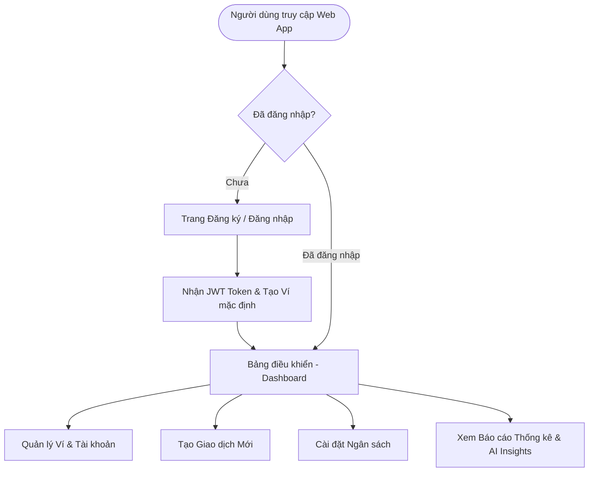
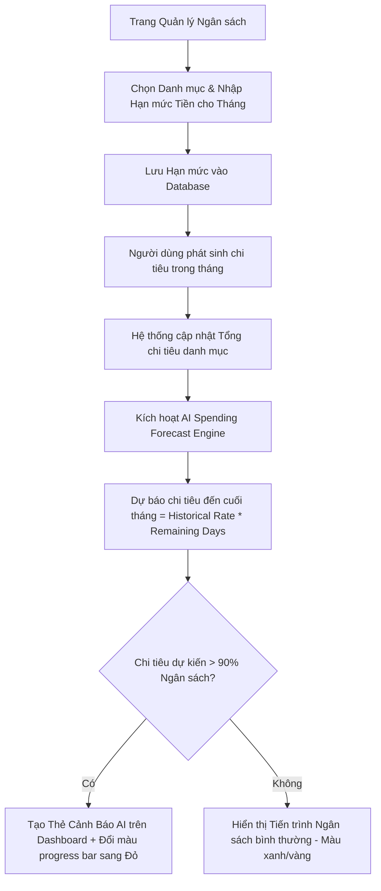

# User Flow Specifications - Budgetly

Tài liệu mô tả chi tiết các Luồng thao tác Người dùng (User Flows) trong ứng dụng **Budgetly**, được trực quan hóa bằng sơ đồ **Mermaid**.

---

## 1. Luồng Tổng quan Ứng dụng (Overall Application Navigation Flow)



---

## 2. Luồng Nhập Giao dịch: Thủ công vs. AI Thông minh (Transaction Entry Flow)

Luồng chi tiết thể hiện sự kết hợp giữa 3 phương thức nhập liệu: Thủ công, Văn bản tự nhiên NLP, và Quét hóa đơn OCR kèm cơ chế kiểm tra điểm tin cậy (Confidence Threshold).

```mermaid
graph TD
    A[Dashboard] --> B{Chọn phương thức nhập liệu}
    
    %% Branch 1: Manual Entry
    B -->|Thủ công| C[Mở Form nhập giao dịch chuẩn]
    C --> C1[Nhập Số tiền, chọn Danh mục, Ví, Ngày]
    C1 --> SaveDirect[Nhấn Lưu Giao dịch]
    
    %% Branch 2: Natural Text NLP
    B -->|Văn bản NLP| D[Nhập câu văn bản: e.g. 'Ăn phở 45k']
    D --> E[AI NLP Service phân tích]
    E --> G{Điểm tin cậy Confidence >= 75%?}
    
    %% Branch 3: OCR Receipt Scan
    B -->|Quét Hóa đơn OCR| F[Tải lên / Chụp ảnh Bill]
    F --> F1[AI OCR Service bóc tách dữ liệu]
    F1 --> G
    
    %% Confidence Decisions
    G -->|Có (High Confidence)| H[Tự động điền Form & Lưu Giao dịch]
    H --> H1[Hiển thị Toast thành công + Nút Hoàn tác]
    
    G -->|Không (Low Confidence / Ảnh mờ)| I[Hiển thị Pop-up xác nhận dữ liệu]
    I --> I1[Người dùng kiểm tra / Chỉnh sửa ô mờ]
    I1 --> SaveDirect
    
    SaveDirect --> DBUpdate[Cập nhật Cơ sở dữ liệu & Cập nhật Số dư Ví]
    DBUpdate --> ReturnDash[Quay lại Dashboard]
```

---

## 3. Luồng Cài đặt Ngân sách & Cảnh báo Chi tiêu AI (Budgeting & AI Alert Flow)

Luồng thể hiện cách hệ thống theo dõi mức chi tiêu của người dùng và phát cảnh báo sớm bằng AI.


