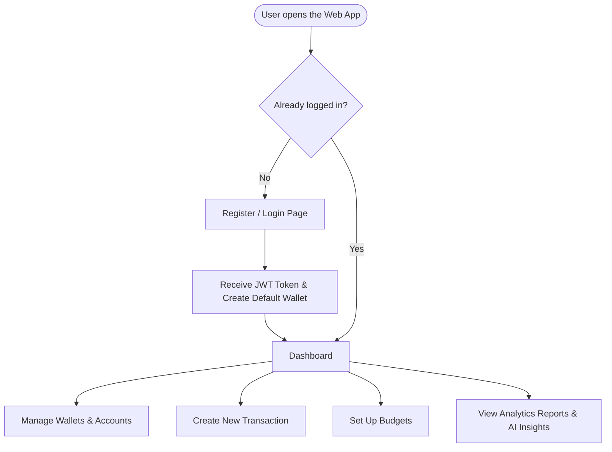
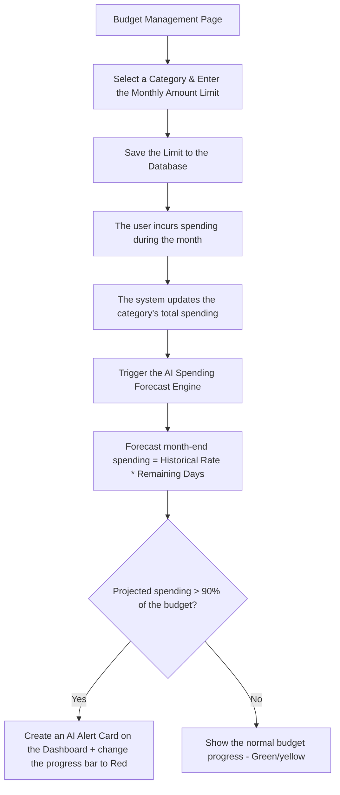

# User Flow Specifications - Budgetly

This document describes in detail the User Flows in the **Budgetly** application, visualized with **Mermaid** diagrams.

---

## 1. Overall Application Navigation Flow

```mermaid
graph TD
    Start([User opens the Web App]) --> CheckAuth{Already logged in?}
    
    CheckAuth -->|No| AuthPage[Register / Login Page]
    AuthPage --> AuthSuccess[Receive JWT Token & Create Default Wallet]
    AuthSuccess --> Dashboard
    
    CheckAuth -->|Yes| Dashboard[Dashboard]
    
    Dashboard --> Nav1[Manage Wallets & Accounts]
    Dashboard --> Nav2[Create New Transaction]
    Dashboard --> Nav3[Set Up Budgets]
    Dashboard --> Nav4[View Analytics Reports & AI Insights]
```

---

## 2. Transaction Entry Flow: Manual vs. Smart AI (Transaction Entry Flow)

The detailed flow shows the combination of 3 input methods: Manual entry, NLP natural-language text, and OCR receipt scanning, together with a confidence threshold check (Confidence Threshold).

```mermaid
graph TD
    A[Dashboard] --> B{Choose the input method}
    
    %% Branch 1: Manual Entry
    B -->|Manual| C[Open the standard transaction entry form]
    C --> C1[Enter Amount, select Category, Wallet, Date]
    C1 --> SaveDirect[Click Save Transaction]
    
    %% Branch 2: Natural Text NLP
    B -->|NLP Text| D[Type a sentence: e.g. 'Ate pho 45k']
    D --> E[AI NLP Service analyzes]
    E --> G{Confidence score >= 75%?}
    
    %% Branch 3: OCR Receipt Scan
    B -->|OCR Receipt Scan| F[Upload / Photograph a receipt]
    F --> F1[AI OCR Service extracts the data]
    F1 --> G
    
    %% Confidence Decisions
    G -->|Yes (High Confidence)| H[Auto-fill the form & save the transaction]
    H --> H1[Show success Toast + Undo button]
    
    G -->|No (Low Confidence / Blurry image)| I[Show a data confirmation pop-up]
    I --> I1[User reviews / edits the highlighted fields]
    I1 --> SaveDirect
    
    SaveDirect --> DBUpdate[Update the Database & refresh Wallet balances]
    DBUpdate --> ReturnDash[Back to Dashboard]
```

---

## 3. Budgeting & AI Alert Flow

The flow shows how the system monitors the user's spending level and issues early warnings with AI.

```mermaid
graph TD
    A[Budget Management Page] --> B[Select a Category & Enter the Monthly Amount Limit]
    B --> C[Save the Limit to the Database]
    
    C --> D[The user incurs spending during the month]
    D --> E[The system updates the category's total spending]
    
    E --> F[Trigger the AI Spending Forecast Engine]
    F --> G[Forecast month-end spending = Historical Rate * Remaining Days]
    
    G --> H{Projected spending > 90% of the budget?}
    
    H -->|Yes| I[Create an AI Alert Card on the Dashboard + change the progress bar to Red]
    H -->|No| J[Show the normal budget progress - Green/yellow]
```
